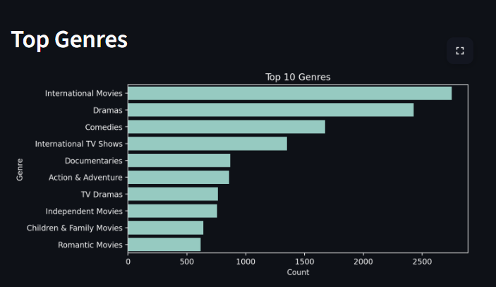
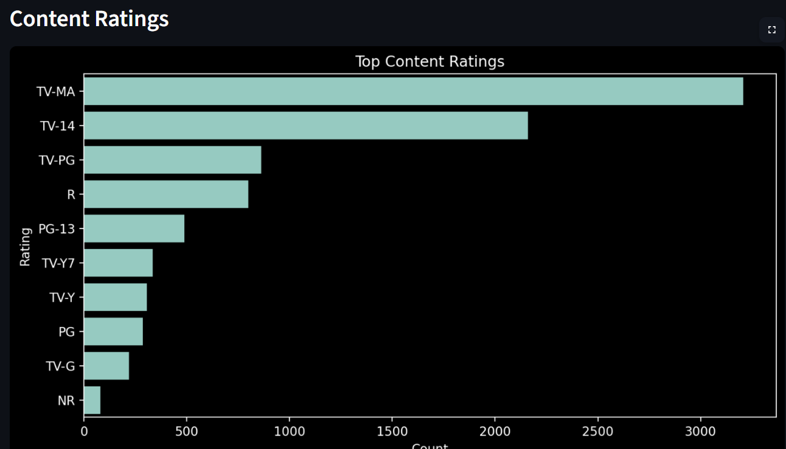
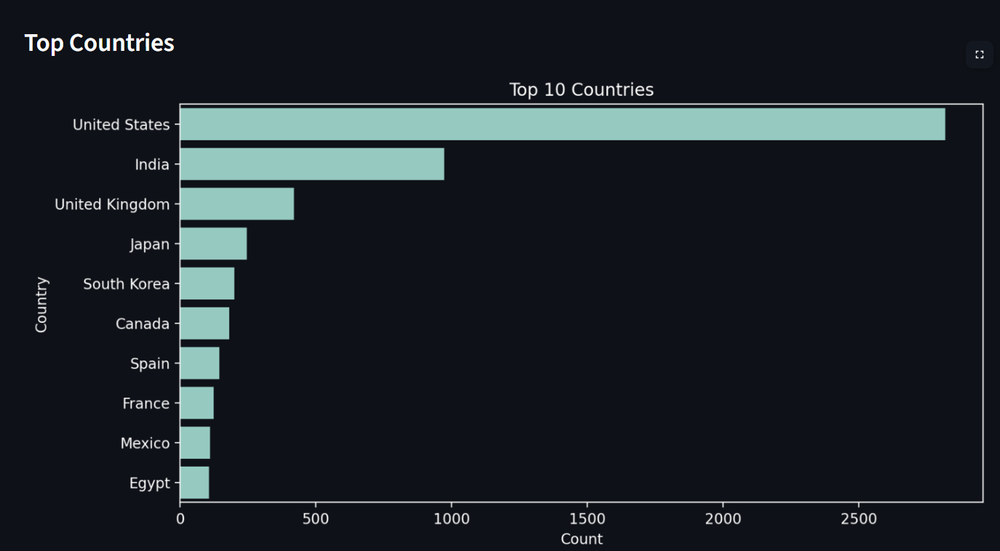

# Netflix Content Analytics Platform

Interactive data analysis and visualization dashboard built using Python and Streamlit to uncover insights from Netflix content data.

## Overview

This project builds a production-style data analysis and visualization pipeline on Netflix's content dataset. It transforms raw data into interactive insights through a deployed dashboard.

The workflow simulates a real-world data analytics lifecycle:

* Data ingestion
* Data cleaning and feature engineering
* Exploratory analysis
* Interactive dashboard development
* Cloud deployment
  
---
## Why This Project

This project demonstrates how raw data can be transformed into actionable insights using real-world data analysis techniques.

It reflects practical skills in:
- Data cleaning and preprocessing
- Exploratory data analysis (EDA)
- Data visualization
- Dashboard development
- Cloud deployment


## Data Source

- Platform: Kaggle  
- Dataset: Netflix Movies and TV Shows  
- Link: https://www.kaggle.com/datasets/shivamb/netflix-shows?select=netflix_titles.csv  
- Records: 8807

---

## Live Application

https://netflix-eda-analysis-57evpnsbttlbafyfnapp9j6e.streamlit.app

---

## Business Problem

Streaming platforms need to:

* Understand content distribution
* Monitor growth trends
* Optimize content strategy
* Improve user engagement

This project explores how Netflix structures its content to balance scale, engagement, and global reach.

---

## Solution Approach

The system follows a layered approach:

1. Raw data ingestion from CSV
2. Data preprocessing and feature engineering
3. Exploratory data analysis
4. Interactive visualization using Streamlit
5. Deployment for public access

---

## Project Architecture

```
                +----------------------+
                |   Raw Dataset (CSV)  |
                +----------+-----------+
                           |
                           v
                +----------------------+
                | Data Processing      |
                | (Pandas)             |
                | - Cleaning           |
                | - Feature Engineering|
                +----------+-----------+
                           |
                           v
                +----------------------+
                | EDA Layer            |
                | - Trends             |
                | - Distributions      |
                | - Aggregations       |
                +----------+-----------+
                           |
                           v
                +----------------------+
                | Streamlit Dashboard  |
                | - Filters            |
                | - Charts             |
                | - KPI Metrics        |
                +----------+-----------+
                           |
                           v
                +----------------------+
                | Cloud Deployment     |
                | (Streamlit Cloud)    |
                +----------------------+
```

---

## Project Structure

```
netflix-eda-analysis/
│
├── data/
│   └── netflix_titles.csv
│
├── app.py
├── notebook.ipynb
├── main.py
│
├── requirements.txt
├── README.md
│
└── .gitignore
```

---

## Tech Stack

| Layer           | Tools Used          |
| --------------- | ------------------- |
| Data Processing | Pandas, NumPy       |
| Visualization   | Matplotlib, Seaborn |
| Application     | Streamlit           |
| Deployment      | Streamlit Cloud     |
| Version Control | Git, GitHub         |

---

## Data Engineering

### Transformations

* Converted `date_added` to datetime
* Extracted `year_added` and `month_added`
* Split and normalized genre column
* Handled missing values

### Data Quality Observations

* Approximately 98 missing `date_added` values
* Inconsistent entries in `rating` column
* Multi-country values not fully normalized

---

## Analytical Insights

### Content Distribution

Movies account for approximately 70% of the dataset, indicating a strong focus on high-volume content.

### Growth Trend

Content additions increased rapidly after 2015, peaking around 2019. This reflects a major expansion phase.

### Audience Targeting

Most content falls under TV-MA and TV-14, suggesting a focus on mature audiences.

### Geographic Distribution

Top contributing countries include:

* United States
* India
* United Kingdom

This indicates a global content acquisition strategy.

### Genre Distribution

Top genres include:

* International Movies
* Dramas
* Comedies

This highlights a focus on globally relevant and narrative-driven content.

### Engagement Strategy

* Movies provide catalog breadth
* TV shows support long-term engagement

---

## Dashboard Features

* Filter by:

  * Content type (Movie / TV Show)
  * Country
  * Rating
  * Title search

* Visualizations:

  * Content added over time
  * Genre distribution
  * Country distribution
  * Rating distribution

* Key metrics:

  * Total titles
  * Movies vs TV shows

---
## Dashboard Preview

<p align="center">
  
  
  
</p>

---

## Key Takeaways

* Netflix is primarily movie-focused but expanding TV content
* Rapid growth occurred after 2015
* International content is central to platform strategy
* TV shows play a major role in user retention

---

## Future Improvements

* Recommendation system using machine learning
* Natural language processing on descriptions
* Genre clustering
* Interactive UI enhancements
* Time-series forecasting

---

## Author

https://github.com/bringerofdarkness

---

## License

This project is for educational and portfolio purposes.
